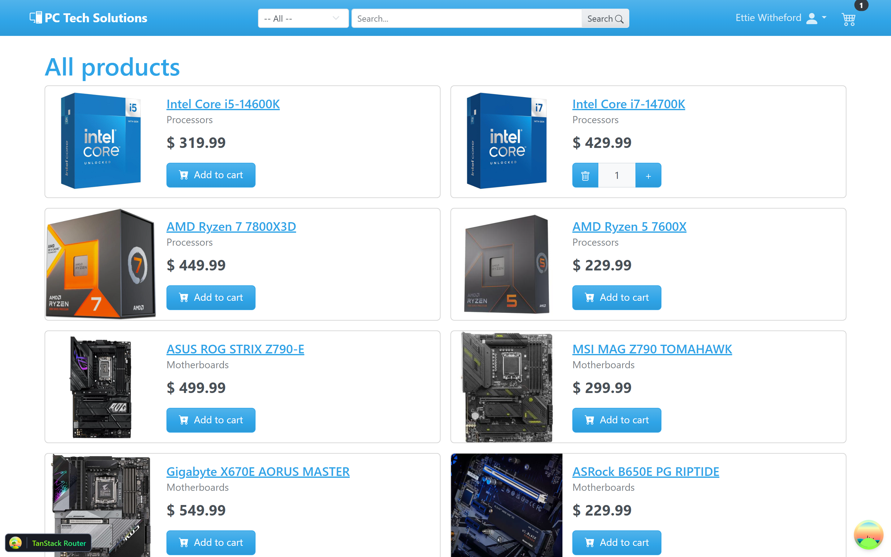
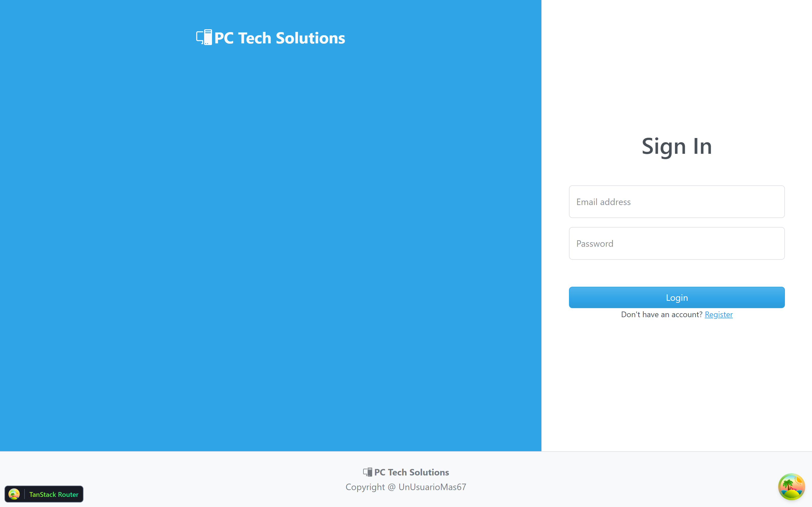
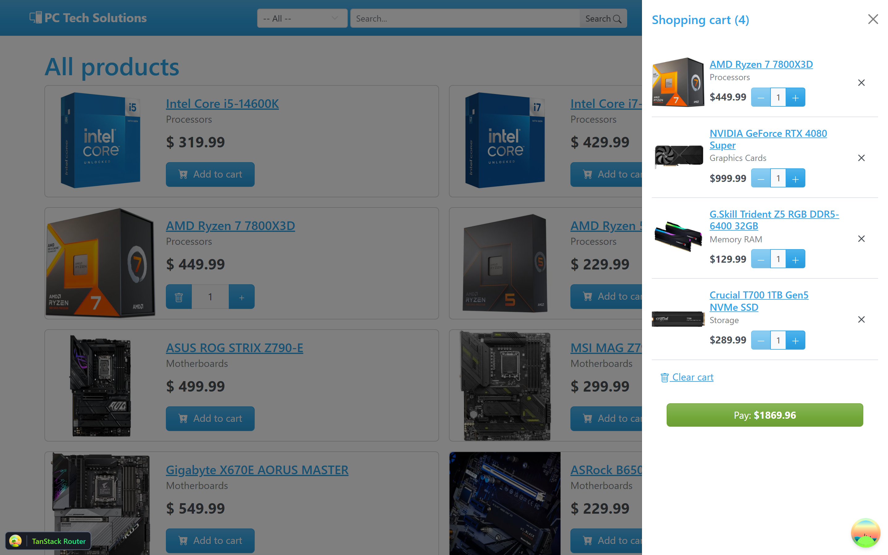
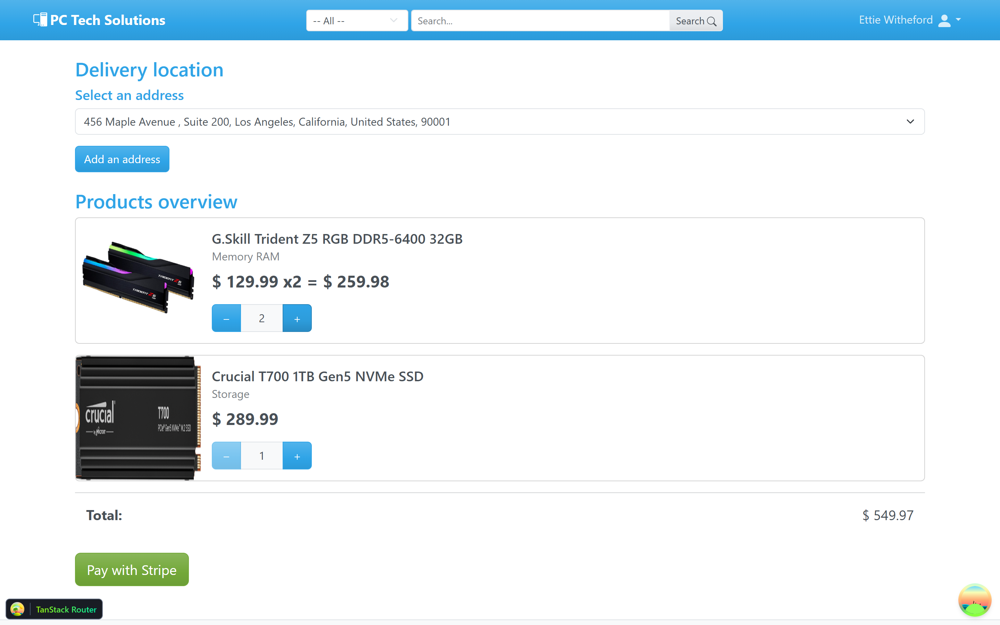
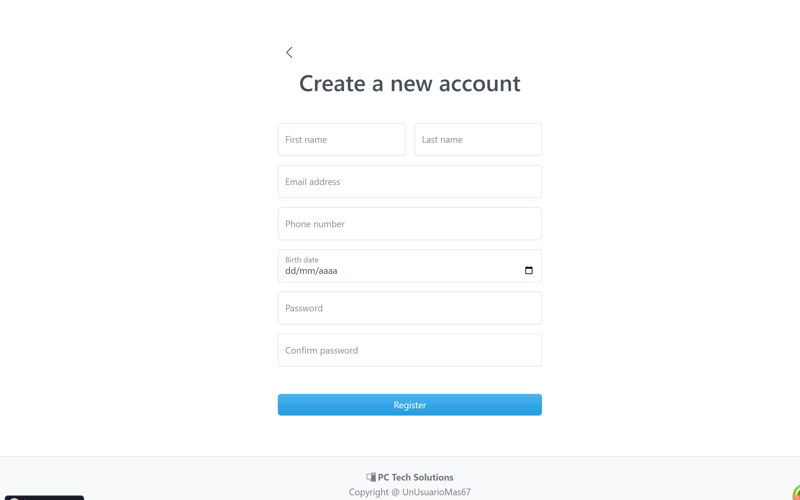

# PC Tech Solutions

An e-commerce platform consisting of a REST API, a client SPA, and an admin dashboard.

Solution for the roadmap.sh project: [E-Commerce API](https://roadmap.sh/projects/ecommerce-api)



## Tech Stack

### API (`ECommerce.Api`)

| Technology | Version | Purpose |
|---|---|---|
| ASP.NET Core Minimal API | .NET 9.0 | REST Backend |
| Entity Framework Core | 9.0.11 | ORM + Migrations |
| SQL Server | - | Database |
| JWT Bearer Authentication | 9.0.11 | Authentication |
| BCrypt.Net-Next | 4.0.3 | Password hashing |
| FluentValidation | 12.1.1 | Input validation |
| Stripe.net | 51.0.0 | Payment processing |
| Scalar | 2.12.25 | OpenAPI documentation |
| RESTCountries.NET | 3.6.0 | Country data seeding |

### Frontend (`ecommerce_frontend`)

| Technology | Version | Purpose |
|---|---|---|
| React | 19.2 | UI Library |
| TypeScript | 6.0 | Static typing |
| Vite | 8 | Bundler |
| TanStack Router | 1.170 | File-based routing |
| TanStack React Query | 5.101 | Server state management |
| React Bootstrap | 2.10 | UI Components |
| React Hook Form | 7.76 | Form management |
| Zod | 4.4 | Schema validation |

### Dashboard (`ECommerce.Dashboard`)

| Technology | Version | Purpose |
|---|---|---|
| ASP.NET Core MVC | .NET 9.0 | Admin panel |

## Project Structure

```
ECommerceAPI/
├── ECommerce.Api/              # REST API (Minimal API)
│   ├── Entities/               # Domain models
│   ├── Endpoints/              # Endpoint groups
│   ├── Services/               # Business logic
│   │   ├── Auth/               # JWT + Refresh tokens
│   │   ├── Checkout/           # Stripe + Background jobs
│   │   ├── DataAccess/         # CRUD / Domain services
│   │   ├── Files/              # Image handling
│   │   └── Mapping/            # Entity ↔ DTO mappers
│   ├── DTOs/                   # Data Transfer Objects
│   ├── EF/                     # DbContext, Configurations, Migrations, Seeding
│   ├── Validators/             # FluentValidation rules
│   ├── Extensions/             # DI + Middleware extensions
│   ├── Settings/               # Configuration models
│   ├── Errors/                 # Domain error records
│   ├── Shared/                 # Result pattern, roles, helpers
│   └── wwwroot/                # Static files (product images)
├── ECommerce.Dashboard/        # Admin Dashboard (MVC)
│   ├── Controllers/
│   ├── Views/
│   ├── Models/
│   ├── Services/
│   └── DTOs/
└── ecommerce_frontend/         # Client SPA (React)
    └── src/
        ├── api/                # API client functions
        ├── components/         # Reusable UI components
        ├── hooks/              # Custom hooks
        ├── routes/             # TanStack Router pages
        ├── schemas/            # Zod validation schemas
        └── themes/             # Bootstrap themes
```

## Entities

| Entity | Description |
|---|---|
| **Client** | E-commerce users |
| **Admin** | Platform administrators |
| **Product** | Product catalog (with images, SKU, stock) |
| **Category** | Product categories (with slug) |
| **Cart / CartItem** | Shopping cart per client |
| **ShopOrder** | Orders generated from checkout |
| **OrderLine** | Product lines within an order |
| **OrderStatus** | Statuses: Pending, Paid, Expired |
| **Payment** | Payments recorded via Stripe |
| **Address** | Shipping addresses |
| **Country** | Countries (seeded from REST Countries) |
| **RefreshToken** | Refresh tokens (separate for Client/Admin) |

## Features

### Authentication
- Registration and login for **Client** and **Admin** with separate roles
- JWT access tokens + refresh tokens
- BCrypt password hashing
- Logout with refresh token invalidation

### Product Catalog
- Full CRUD with image upload (JPG/PNG, max 5MB)
- Category assignment
- SKU and stock management
- Product restock
- Search and pagination

### Shopping Cart
- Create, update, and delete carts per client
- Add products with stock validation
- Duplicate prevention

### Checkout & Payments
- **Stripe Checkout** integration (redirect to payment session)
- Webhook handler for `checkout.session.completed` and `checkout.session.expired`
- Automatic stock deduction on successful payment
- Orders with automatic expiration (15 min default)
- Background service that expires and cleans up overdue orders

### Order Management
- Client order history
- Admin view of all orders
- Filter by client or product

### Addresses
- CRUD for client shipping addresses
- Countries seeded from the REST Countries API

### Documentation
- OpenAPI 3.1 + Scalar UI in development mode
- Bearer auth pre-configured for testing

## Configuration

### Environment Variables (`appsettings.json`)

#### `ECommerce.Api`

```json
{
  "ConnectionStrings": {
    "ECommerceDb": "Server=...;Database=...;Trusted_Connection=true;TrustServerCertificate=true"
  },
  "JwtSettings": {
    "SecretKey": "your-secret-key",
    "Issuer": "www.ecommerce.com",
    "Audience": "www.ecommerce.com",
    "AccessTokenExpirationMinutes": 15,
    "RefreshTokenExpirationDays": 7
  },
  "Stripe": {
    "SecretKey": "sk_test_...",
    "WebhookSecret": "whsec_..."
  },
  "OrderExpirySettings": {
    "ExpireMinutes": 15,
    "DeleteExpiredAfterHours": 24,
    "CheckExpiryMinutes": 5
  }
}
```

#### `ECommerce.Dashboard`

```json
{
  "ApiSettings": {
    "ApiUrl": "",
    "ImagesUrl": ""
  },
  "AuthSettings": {
    "JwtCookieKey": "api_jwt",
    "RefreshCookieKey": "api_refresh",
    "JwtExpireCookieKey": "jwt_expires_at",
    "SecondsLeftBeforeRefresh": 15
  }
}
```

## Getting Started

### API

```bash
cd ECommerce.Api
dotnet run
```

The API starts in development mode with:
- Automatic EF Core migrations
- Initial data seeding (categories, products, clients, countries)
- Scalar/OpenAPI docs at `<host-url>/scalar/v1`

### Frontend

```bash
cd ecommerce_frontend
npm install
npm run dev
```

### Dashboard

```bash
cd ECommerce.Dashboard
dotnet run
```

### Stripe webhook

Visit https://docs.stripe.com/webhooks#register-webhook for information on how to set up a listener for Stripe events and register the webhook endpoint `<host-url>/api/checkout/webhook`. You must have a Stripe account for this.

## Key Endpoints

| Method | Route | Auth | Description |
|---|---|---|---|
| POST | `/api/clients/register` | - | Register client |
| POST | `/api/clients/login` | - | Login client |
| POST | `/api/admins/login` | - | Login admin |
| GET | `/api/products` | - | List products (paginated) |
| GET | `/api/products/{id}` | - | Product detail |
| GET | `/api/categories` | - | List categories |
| POST | `/api/carts` | Client | Create cart |
| POST | `/api/checkout/session` | Client | Create Stripe session |
| GET | `/api/orders/me` | Client | Client orders |
| GET | `/api/orders` | Admin | All orders |
| POST | `/api/products` | Admin | Create product |
| DELETE | `/api/products/{id}` | Admin | Delete product |

Visit `/scalar` route to view the API documentation.

## Images






